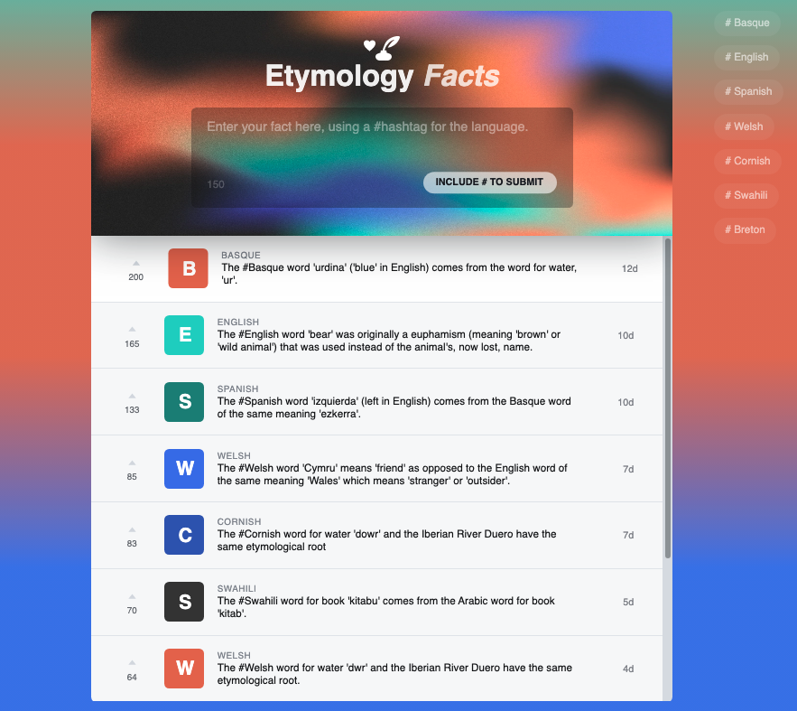

## Goal

To create a message board where you can post etymology facts, using a hashtag system that will allow you to filter your facts by language.

## Screenshots

## Technologies and Dependencies

#### Front-end

- JavaScript
- TypeScript
- React
- HTML
- CSS
- Radix-UI

#### Front-end

- Node.js
- MongoDB
- TypeScript
- Express
- Mongoose

#### Development Tools

- VS Code
- Git
- Github
- Chrome DevTools

